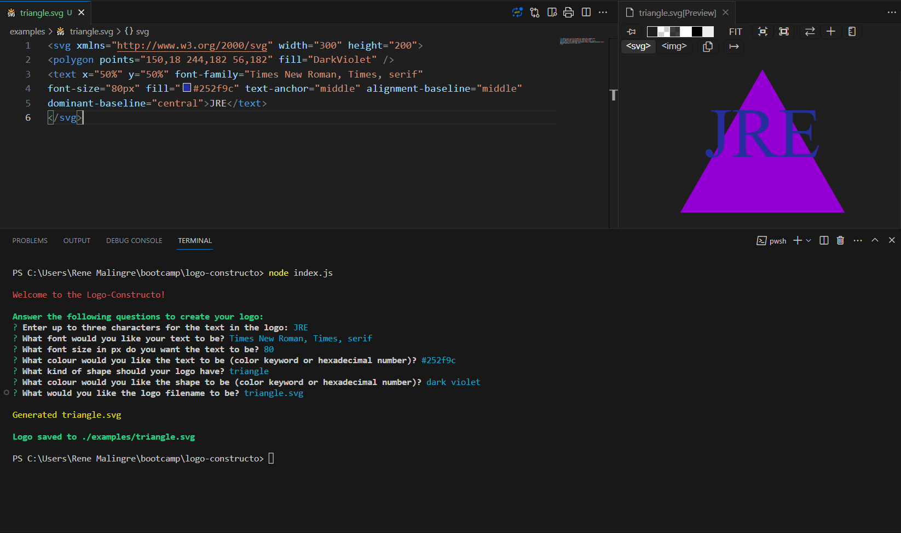

# Logo-Constructo

 [](https://opensource.org/licenses/MIT)

A command-line application that constructs a simple SVG logo based on user input.

## Description

This is a command-line application that dynamically constructs a simple logo consisting of a shape (square, circle, triangle or diamond) and up to three characters. The font family, font size, text colour and shape colour can be selected by the user through a Node.js Inquirer command line interface. The completed SVG logo is saved in the './examples' directory with a user-entered file name.

## Table of Contents

- [Technologies Used](#technologies-used)
- [Example](#example)
- [Installation](#installation)
- [Usage](#usage)
- [Screenshot](#screenshot)
- [Usage Video](#usage-video)
- [License](#license)
- [Contributing](#contributing)
- [Questions](#questions)

## Example

Examples of logos generated by the application:


## Technologies Used

- JavaScript
- Node.js
- Inquirer npm package
- SVG
- Classes
- Jest JavaScript Testing Framework npm package

The application is written in JavaScript and runs in Node.js. The Node.js Inquirer npm package is used to create the command line interface. The SVG logo is constructed using JavaScript classes. The Jest npm package is used for testing. The application is tested to ensure that the user input is validated and that the SVG logo is constructed correctly. User colour entries are validated using a regular expression to check for a valid hex colour code, or against a list of valid colour names loaded from a JSON file.
  
## Installation
  
Fork or copy the repository to your own machine. To install the necessary dependencies, run the following command in the terminal:
  
```bash
npm i
```
  
## Usage

 Open the terminal and navigate to the directory where you copied the repository.  Run the following command:

```bash
node index.js
```

Follow the prompts in the terminal to enter the customisation and file name for your SVG logo.  The application will save the file in the './examples' directory. You can open the file in your browser or your preferred graphics program, or use a VS Code SVG viewer extension to view the logo.

## Screenshot

Screenshot of the application date entry and resultant SVG logo:



## Usage Video

Video of the application in use:

- Link to the video on Google Drive: [Online Video](https://drive.google.com/file/d/1Nd7BoJBPBKVPvbqFlVQ4uC-vly9lHxOD/view?usp=sharing)

- Link to the video on this repository: [GitHub Video](./docs/video/application-demo.mp4)

## License
  
This repository is licensed under the [MIT](https://opensource.org/licenses/MIT) license.
  
## Contributing
  
Contributions to this project will not be accepted, as this project is an assessment piece for a coding course, and it must be the project author's own work. However, feel free to fork the repository and make your own changes.
  
## Questions
  
If you have any questions about the repository, open an issue or contact me directly at:
[rene.malingre@gmail.com](mailto:rene.malingre@gmail.com).
  
You can find more of my work at [GitHub](https://github.com/ReneMalingre).

## Credits

Command line questions: [Inquirer npm package](https://www.npmjs.com/package/inquirer)

JavaScript runtime: [Node.js](https://nodejs.org/en/)

JavaScript testing: [Jest npm package](https://www.npmjs.com/package/jest)
